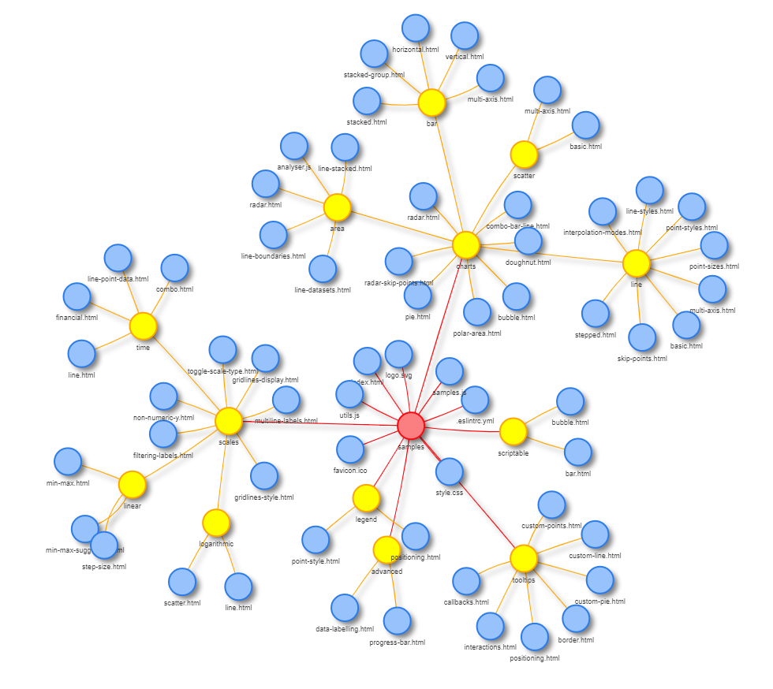
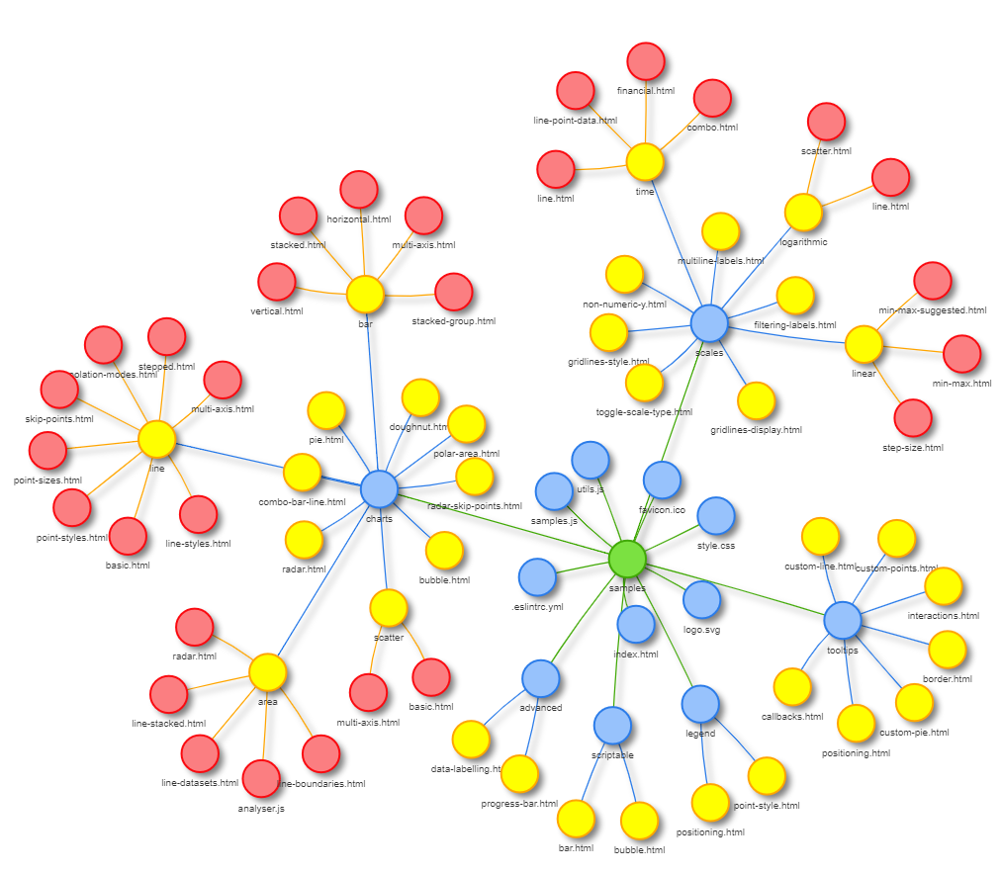
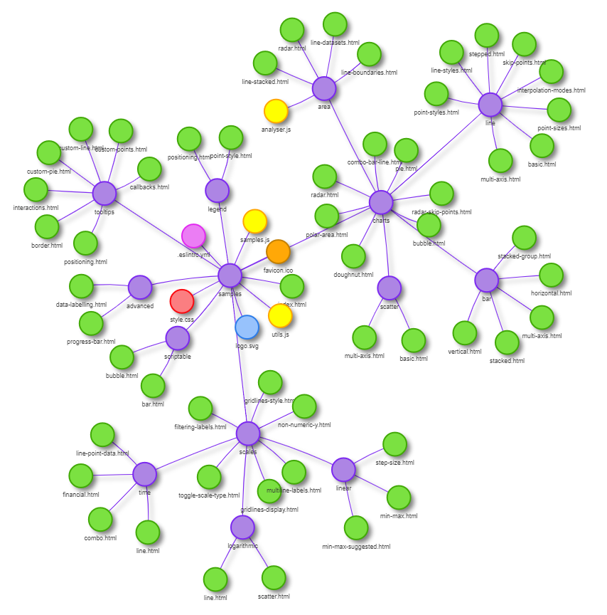
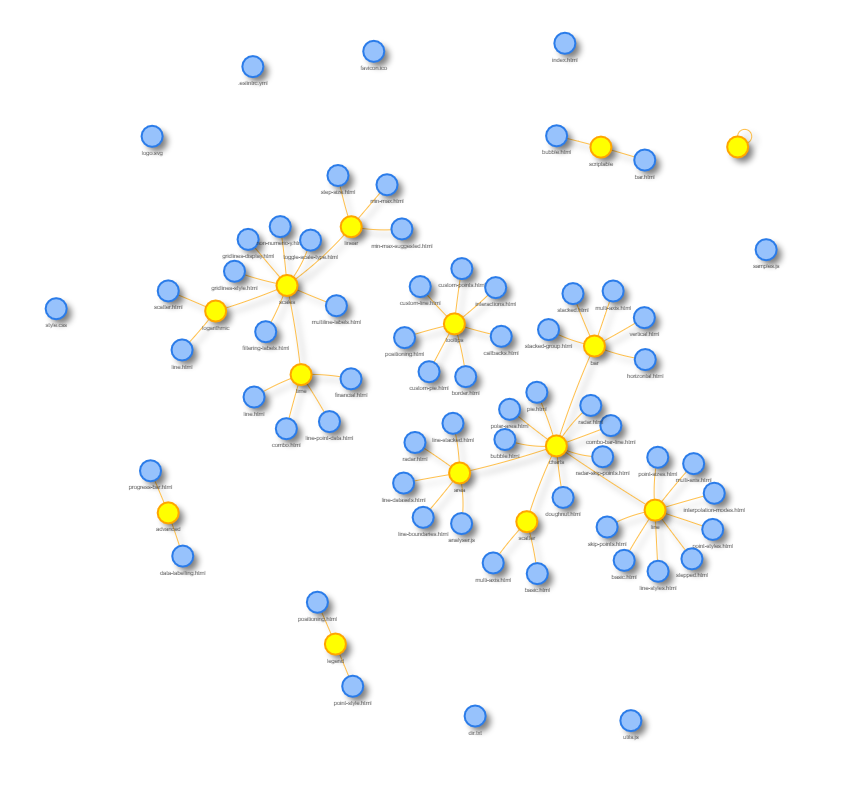

# Tree
*This visualizer is essentially an editted version of a previous github user's work, but has been editted to suit specific needs.*

`Get-ChildItem -Path . -Recurse | ForEach-Object {if ($_.PsIsContainer) {"$($_.FullName) %T"} else {"$($_.FullName) %F"}} > output.txt`

A simple visualizer for file directory tree structures, especially in Windows. Files and folders are visualized as a network, with files and the directories they belong to connected. This can be useful for quickly seeing the structure of all a project's files.

*Visualization of the [`samples`](https://github.com/chartjs/Chart.js/tree/master/samples) directory of the [Chart.js](https://www.chartjs.org/) library*

# Usage

A demo of the program is available here: https://generic-github-user.github.io/Tree/src/. Before using the program, you will need to create a list of files in your chosen directory. Below are instructions to do so.

## Generating a list of files

First, open up Windows PowerShell. On Windows, just press the Windows button in the lower left-hand corner of the screen and search for "PowerShell".

Next, navigate to the directory you want to visualize with `cd C:\Your\Directory\Path`.

Once you're in the correct directory, enter `Get-ChildItem -Path . -Recurse | ForEach-Object {if ($_.PsIsContainer) {"$($_.FullName) %T"} else {"$($_.FullName) %F"}} > output.txt`. This will create a list the all the files and folders save it to a text file called `output.txt` in the directory you are visualizing.

You can close the PowerShell now. Navigate to the directory in Windows Explorer or a similar program and open the text file.

Use `CTRL + A` to select all of the text inside the document, then `CTRL + C` to copy it to your clipboard.

Once you have the list of file paths, just paste it (`CTRL + V`) into the text box and press the "Load" button. The network visualization will automatically be generated. Enjoy!

## Running it locally

If you so desire, you can also run a local clone of the program, although there is no good reason to. The demo version is perfectly good. One quick note: to include the default file maps, you will need to run the program on a local server so that an AJAX call can be made to request the needed data from the text file. The [atom-live-server package](https://atom.io/packages/atom-live-server) for the [Atom](https://atom.io/) text editor works well for this purpose. If not run on a live server, an error will be thrown.

## Settings

A number of settings are available to help customize the visualization.

### Node color

How to determine the color of each node represented.

#### Object Type

By default, nodes are colored by what type of digital object they are. The root node (if it is shown) is one color, folders (sub-directories) are another color, and individual files are a different color.

#### File Level

Alternatively, nodes can be colored by what level within the file tree they are at. Level 1 (root) is one color, level 2 (subfolders of root) are another color, etc.

#### File Type

Nodes are colored based on their file extension; every different extension corresponds to a different node color. Folders are colored differently from all files.

### Show/hide root node

By default, the file path data created by Windows does not include the root directory (the directory that was mapped). If the root node switch is enabled, Tree will automatically generate the root directory node.

If it is not enabled, each sub-directory of the root directory will be displayed as the center of a separate network.

# Tools

## vis.js
http://visjs.org/

The bread and butter of this project. vis.js is used to create the pretty network visualizations and pretty much does all the work for me. It can also do other stuff, like graphs. If you're making graphs though, use [Chart.js](https://getmdl.io/).

## Material Design Lite
https://getmdl.io/

Partly because I wanted the text box to look good and partly because normal CSS isn't already painful enough.

## jQuery
https://jquery.com/

Because it's jQuery.

# Notes

 - If you want to visualize GitHub repositories, see [veniversum](https://github.com/veniversum)'s wonderful [git-visualizer](https://github.com/veniversum/git-visualizer). It works quite similar to Tree, but with GitHub repositories instead of files and folders. Here's a visualization of this repository: https://veniversum.me/git-visualizer/?owner=generic-github-user&repo=Tree
